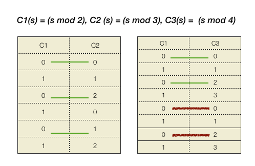

```{r setup, include=FALSE}
library(tidyverse)
library(sugrrants)
library(tsibble)
library(ggridges)
library(viridis)
library(forecast)
library(lubridate)
knitr::opts_chunk$set(echo = FALSE, message=FALSE, warning=FALSE, cache=TRUE, dev.args=list(bg=grey(0.9), pointsize=8))
```

# <span style="color:DarkBlue"> Agenda

- Motivation
- Research aim
- What is EDA? How it can help?
- Research objectives
  - Visualizing probability distributions on deconstructed time
  - Spatio-temporal granularities and probability distribution plots
  - Clustering algorithms for grouping probability distributions on spatio-temporal granularities
- Timeline
- Acknowledgements

---

# <span style="color:DarkBlue"> Motivation

## Electricity smart meter technology 

Smart meters record electricity usage (per kWh) every 30 minutes and send this information to the electricity retailer for billing

.pull-left[
**Consumers** can save considerable amount on their electricity bill by 
<br>
- Switching on their hot water heater or do laundry when energy is cheaper, or when their solar system is generating surplus energy 
- Switching off appliances during peak demands
- Check usage and compare with similar homes 
]
.pull-right[

**Retailers** can reduce costs and increase efficiency
- Lowering metering and connection fees 
- Drawing insights into when customer is home, or sleeping, or even what appliances they are using based on usage figures
- Rewarding customers for mindful usage
]

---

## <span style="color:DarkBlue">  Data description (~ 40 billion half hourly observations)

.pull-left[

.center-left[
- Source
<br>
<br>
- Frequency
<br>
<br>
- Time Frame
<br>
<br>
- Spread
<br>
<br>
- Type
<br>
<br>
- Dimension
]
]

.pull-right[
.center-left[
Data61, CSIRO
<br>
<br>
<br>
Half hourly interval meter reading (Kwh)
<br>
<br>
<br>
2012 to 2014
<br>
<br>
<br>
14K (approx.) households based in Newcastle, New South Wales, and parts of Sydney
<br>
<br>
Spatio - Temporal Data
<br>
<br>
<br>
Univariate
]
]

---
class: middle left

# <span style="color:DarkBlue">  Research aim

## <span style="color:Black"> Provide a platform to <span style="color:Crimson"> systematically explore <span style="color:Black">  multiple perspectives of <span style="color:Crimson"> spatio-temporal data <span style="color:Black"> across deconstructed time and space to find regular patterns or anomalies, explore clusters of behaviors or summarize the behavior through <span style="color:Crimson"> visualizing probability distributions <span style="color:Black">

---
## <span style="color:DarkBlue">  What is Exploratory Data Analysis?

.pull-left[
<br>
.center[

]
]
.pull-right[
<br>
<br>
Developed by **John Tukey** as a way of _*systematically*_ using the tools of statistics on a problem before a hypotheses about the data were developed

###  How can it help?

 - Big problem broken into pieces by focusing on subsets
<br>
 - Visualization of <span style="color:Crimson"> probability distributions <span style="color:Black"> at varying resolutions of time and space
<br>
 - Find regular patterns/ anomalies or pockets of similar behavior
<br>
 - Each visual representation poses a question
<br>
 - Action: draw insights or refine question
]

---

class: middle left

# <span style="color:DarkBlue"> Research objectives

- ### Visualization of probability distributions of deconstructed temporal data
<br>
<br>
- ### Spatio-temporal granularities and probability distribution plots
<br>
<br>
- ### Clustering algorithms for grouping probability distributions on spatio-temporal granularities
<br>
<br>
  

---
class: middle center

# <span style="color:DarkBlue"> Visualization of probability distributions of deconstructed temporal data

---

# <span style="color:DarkBlue"> Deconstructing temporal data - Granularities

.pull-left[
## Arrangement of time

 a) Linear  
 b) Cyclic
<br>
<br>
- <span style="color:#c33c3c"> **Granularities** : <span style="color:Black">  Abstractions of time based on Calendar
<br>
<br>
- <span style="color:#c33c3c"> **Linear granularities** : <span style="color:Black"> Days, weeks, months, years
<br>
<br>
- <span style="color:#c33c3c"> **Circular granularities** : <span style="color:Black"> DoW, MoY or HoD and nearly circular granularities like DoM or WoM   
]

.pull-right[
.center[]
]

 
---
class: middle left

# <span style="color:DarkBlue"> Visualizing distributions across circular granularities (I)

## Data description: 
**Source** ~  Buildings and Property Division at Monash University  
<br>
**Frequency** ~ 30 minutes interval smart meter data of Monash 
Residential Services  
<br>
**Time frame** ~ April 4, 2018 to May 31, 2018  
<br>
**Spread** ~ 73 living units (B1 05 and B4 29 chosen for analysis)  
---
class: top center

# <span style="color:DarkBlue"> Across <span style="color:Crimson">Day-of-Week

```{r okaygraph1, fig.height=6, fig.width=4,echo=FALSE}
load("Units_Data.Rdata")

Units_Data$`Timestamp UTC` <-lubridate::ymd_hms(Units_Data$`Timestamp UTC`)


vic_holidays <- holiday_aus(2018, state = "VIC")

SU_uniform_mutate <-Units_Data  %>% mutate(date = date(`Timestamp UTC`),wday = wday(date, label = TRUE, abbr = TRUE,
                       week_start = 1),
                       month = month(date, label = TRUE, abbr = TRUE),
                       year = year(date),
                       hour = hour(`Timestamp UTC`),
                       work = ifelse(wday %in% c("Mon", "Tue", "Wed", "Thu", "Fri"), "Yes", "No"))
                       
                       
p1 = SU_uniform_mutate %>% filter(Source=="B1 05") %>%
  group_by(date) %>%
  summarise(dkwh = sum(Value, na.rm=TRUE)) %>%
  mutate(wday = wday(date, label = TRUE, abbr = TRUE,
                     week_start = 1)) %>%
  ggplot(aes(x=wday, y=dkwh)) + geom_boxplot() + ylab("Energy consumption in KwH ") +  xlab("Day-of-Week") +
    coord_cartesian(ylim = c(0,0.6)) + ggtitle("B1 05")
   
p2 = SU_uniform_mutate %>% filter(Source=="B4 29") %>%
  group_by(date) %>%
  summarise(dkwh = sum(Value, na.rm=TRUE)) %>%
  mutate(wday = wday(date, label = TRUE, abbr = TRUE,
                     week_start = 1)) %>%
  ggplot(aes(x=wday, y=dkwh)) + geom_boxplot() + ylab("Energy consumption in KwH ") + xlab("Day-of-Week") +
    coord_cartesian(ylim = c(0,0.6)) + ggtitle("B4 29")

```
.pull-left[
```{r b105-1,echo=FALSE}
 p1
```
]
.pull.right[
```{r b429-1, echo=FALSE}
p2
```
]
---
class: top center

##<span style="color:DarkBlue"> Across  <span style="color:Crimson"> Day-of-Week <span style="color:DarkBlue"> and <span style="color:Crimson"> Hour-of-Day 

```{r okaygraph2,echo=FALSE}
p3 = SU_uniform_mutate %>% filter(Source=="B1 05") %>%
  group_by(wday,hour) %>% filter(wday %in% c("Tue","Wed","Thu","Fri","Sat","Sun")) %>% 
  ggplot(aes(x=as.factor(hour), y=Value,group=hour)) + geom_boxplot() +
  facet_wrap(~wday) + 
  ylab("Daily Consumpttion in KwH") +
  xlab("Hour-of-Day")+ 
    coord_cartesian(xlim= c(0,23), ylim = c(0,0.75))+  scale_x_discrete(breaks=c(0,5,10,15,20))+  ggtitle("B1 05")

p4 = SU_uniform_mutate %>% filter(Source=="B4 29") %>%
  group_by(wday,hour) %>% filter(wday %in% c("Tue","Wed","Thu","Fri","Sat","Sun")) %>% 
  ggplot(aes(x=as.factor(hour), y=Value, group=hour)) + geom_boxplot() +
  facet_wrap(~wday) + 
  ylab("Daily Consumpttion in KwH") +
  xlab("Hour-of-Day") +  
    coord_cartesian(xlim= c(0,23), ylim = c(0,0.75))+ scale_x_discrete(breaks=c(0,5,10,15,20))+  ggtitle("B4 29")

```
.pull-left[
```{r b105-2,echo=FALSE}
 p3
```
]

.pull.right[
```{r b429-2,echo=FALSE}
p4
```
]


---
class: top center

## <span style="color:DarkBlue">  Across <span style="color:Crimson">Hour-of-Day <span style="color:DarkBlue"> and <span style="color:Crimson">Work-Day/Non-Work-Day

```{r okaygraph, fig.height=6, fig.width=4,echo=FALSE}
 s1 <- SU_uniform_mutate %>%
  mutate(work = ifelse(date %in% vic_holidays$date, "No", work))

 
b1_Quantile <- s1 %>% filter(Source=="B1 05") %>% group_by(work,hour) %>% 
   do({x <- .$Value
   map_dfr(.x = seq(0.1,0.9,0.1),
           .f = ~ tibble(Quantile = .x,
                             Value = quantile(x, probs = .x,na.rm=TRUE)))
   })
 
p5 <- b1_Quantile %>% ggplot(aes(x=hour,y=Value,col=as.factor(Quantile))) +geom_line() + scale_x_continuous(breaks=seq(1, 24, 5)) +theme(legend.position = "bottom") + facet_wrap(~work, labeller = "label_both") + 
ylab("Daily Consumpttion in KwH") +  xlab("Hour-of-Day")+ coord_cartesian(ylim = c(0,0.75)) + ggtitle("B1 05")

b2_Quantile <- s1 %>% filter(Source=="B4 29") %>% group_by(work,hour) %>% 
   do({x <- .$Value
   map_dfr(.x = seq(0.1,0.9,0.1),
           .f = ~ tibble(Quantile = .x,
                             Value = quantile(x, probs = .x,na.rm=TRUE)))
   })
 
p6 <- b2_Quantile %>% ggplot(aes(x=hour,y=Value,col=as.factor(Quantile))) +geom_line() + scale_x_continuous(breaks=seq(1, 24, 5)) +theme(legend.position = "bottom") + facet_wrap(~work, labeller = "label_both") + ylab("Daily Consumpttion in KwH") +  xlab("Hour-of-Day") + coord_cartesian(ylim = c(0,0.75)) +  ggtitle("B4 29")

# grid.arrange(p5, p6,  ncol = 2)
```
.pull-left[
```{r b105-3, echo=FALSE}
 p5
```
]
.pull.right[
```{r b429-3, echo=FALSE}
p6
```
]
---

class: middle left

# <span style="color:DarkBlue"> Interpretations

- ### Aggregating information across different circular granularities communicates completely different aspects of data
<br>
- ### Exhaustive sets of visual representation required for multiple perspectives on data

---

class: middle left

# <span style="color:DarkBlue"> Visualizing distributions across circular granularities (II)
  
.pull-left[
### Can combinations of these circular granularities be plotted for effective exploration?
<br>
a) <span style="color:Crimson"> Day-of-Year <span style="color:Black"> and <span style="color:Crimson"> Day-of-Month <span style="color:Black">  
b) <span style="color:Crimson">Week-of-Month <span style="color:Black"> and <span style="color:Crimson">Day-of-Month
<span style="color:Black">  
c) <span style="color:Crimson">Week-of-Month <span style="color:Black">and <span style="color:Crimson">Week-of-Year
<span style="color:Black">  
d) <span style="color:Crimson">Month-of-Year <span style="color:Black"> and <span style="color:Crimson">Day-of-Year
<span style="color:Black">  
<br>

- **Frequency** ~ 30 minutes interval smart meter data  
- **Time frame** ~ January, 2002 to March 1, 2015 
- **Spread** ~ Australian States (Victoria chosen)

]

.pull-right[
```{r moy-dom,echo=FALSE, fig.height=7, fig.width=5}

VIC <- read.csv("VIC2015/Data/demand_VIC.csv")
VIC$Date <- as.Date(VIC$Date,origin = "1899-12-30")

first_day_of_month_wday <- function(dx) {
  day(dx) <- 1
  wday(dx)
}

VIC <- VIC %>%mutate(Indx_Year = year(Date),
                     Indx_Month = month(Date, label = FALSE, abbr = TRUE),
                     Indx_Wk_Yr = week(Date),
                     Indx_Wk_Month = ceiling((day(Date) + first_day_of_month_wday(Date) - 1) / 7),
                     Indx_Day_Week = wday(Date, label=FALSE, abbr=TRUE,
                                          week_start=1),

                     Indx_Day_Month = day(Date),

                     Indx_Day_Year =  yday(Date),

                     Indx_Weekend=if_else(Indx_Day_Week %in% c(6,7),1,0),

                     Indx_HlHr_day = Period,
                     month = month(Date, label = FALSE, abbr = TRUE),
         year =  year(Date),
         yday =yday(Date),
         wday = wday(Date, label=FALSE, abbr=TRUE,
                     week_start=1),
         bow = (wday - 1) * 48 + Period,
         dom = day(Date),
         bom = (dom - 1) * 48 + Period,
         Weekend=if_else(wday %in% c(6,7),1,0),
         Indx_hour = ceiling(Period/2),
         Indx_Hour_Yr = Indx_hour + 24*(yday-1),
         Indx_Hour_Month = Indx_hour + 24*(Indx_Day_Month-1),
         Indx_Hour_Wk = Indx_hour + 24*(wday-1))
         
         


VIC <- as_tibble(VIC)
```

```{r allFig, out.height=400,out.width="120%", echo=FALSE, eval=TRUE, fig.align="center"}
library(lvplot)
library(gridExtra)

par(mfrow = c(2, 2))

p1 <- VIC%>% filter(year %in% c(2012, 2013, 2014),Indx_Day_Month %in% c(1,15,29,31))%>% ggplot(aes(yday,OperationalLessIndustrial,group = yday)) + geom_boxplot(width=10)+ facet_wrap(~Indx_Day_Month) + ylab("Electricity Demand [KWh]") +
  xlab("Days of the Year") + scale_x_discrete(breaks=seq(0,366,60)) +theme(legend.position = "bottom",strip.text = element_text(size = 7, margin = margin())) + ggtitle("(a) Boxplot")


p2 <- VIC%>% filter(year %in% c(2012, 2013, 2014),Indx_Wk_Month %in% c(1,2,4))%>% ggplot(aes(as.factor(Indx_Day_Month),OperationalLessIndustrial)) + geom_violin(alpha = 0.03)+ facet_wrap(~Indx_Wk_Month,nrow=3) + ylab("") + xlab("Days of the Month") + theme(legend.position = "bottom",strip.text = element_text(size = 7, margin = margin())) + scale_x_discrete(breaks=seq(0,31,5))+ scale_y_continuous(breaks = seq(2000,9000,2000))+ ggtitle("(b) Violin plot")


p3 <- VIC%>% dplyr:::filter(year %in% c(2012, 2013, 2014),Indx_Wk_Month %in% c(1,2,5),Indx_Wk_Yr <20)%>% ggplot(aes(x=OperationalLessIndustrial,y=as.factor(Indx_Wk_Yr),group=Indx_Wk_Yr)) + geom_density_ridges2() +facet_wrap(~Indx_Wk_Month) + xlab("Electricity Demand [KWh]") + ylab("Weeks of the Year") + scale_x_continuous(breaks = seq(2000,10000,3000)) + theme(legend.position = "bottom",strip.text = element_text(size = 7, margin = margin())) + ggtitle("(c) Ridge plot")


VIC_moy_doy <- VIC%>% filter(year %in% c(2012, 2013, 2014)) %>%
  group_by(Indx_Month,yday) %>%
  do({x <- .$OperationalLessIndustrial
  map_dfr(.x = seq(0.1,0.9,0.1),
          .f = ~ tibble(Quantile = .x,
                            Value = quantile(x, probs = .x,na.rm=TRUE)))
  }) %>%  filter(Indx_Month %in% c(1,7,11))

p4 <- VIC_moy_doy %>%ggplot(aes(x=yday,y=Value,col=as.factor(Quantile),group=yday)) + geom_line() + facet_wrap(~Indx_Month)+ scale_x_continuous(breaks=seq(1, 336, 120)) + ylab("")  + xlab("Day of the Year") + theme(legend.position = "none",strip.text = element_text(size = 7, margin = margin())) + ggtitle("(d) Decile plot")

grid.arrange(p1, p2, p3, p4, ncol = 2)

```
]
---


# <span style="color:DarkBlue"> Harmonies and Clashes

### **Harmonies: ** <span style="color:Black"> Combinations of circular granularities which facilitate EDA when plotted together

Examples: 
- DoW and HoD
- HoD and Working Day/ Non-Working Day
- DoW and MoY

### **Clashes: ** <span style="color:Black"> Combinations of circular granularities which are incompatible for EDA when plotted together

Examples: 
- DoY and DoM
- MoY and DoY
- WoM and DoM


---
class: middle left 
# <span style="color:DarkBlue"> Interpretations

## Why Harmonies work and Clashes don't?

- Nature of circular time granularities and their relationship in terms of mapping to calendars
<br>
<br>
## Need to formalize the theory of granularities to study their properties

---
# <span style="color:DarkBlue"> Linear Time Granularities 

_* "A Glossary of Time Granularity Concepts"* by Bettini et al. _

### Definition: Time Domain
A **time domain** is a pair $(T; \le)$ where $T$ is a non-empty set of time instants and $\le$ is a total order on $T$.

### Definition: Linear Granularity
A linear **granularity** is a mapping $G$ from the integers to subsets of the time domain such that:

  (C1) if $i < j$ and $G(i)$ and $G(j)$ are non-empty, then each element of $G(i)$ is less than all elements of $G(j)$, and  
  (C2) if $i < k < j$ and $G(i)$ and $G(j)$ are non-empty, then $G(k)$ is non-empty.  
<br>
<br>
The first condition implies that the granules in a linear granularity are non-overlapping and their index order is same as time order
<br>
<br>
<span style="color:Crimson">  These definitions for linear granularities are inadequate for conceptualizing circular granularities since the linearity imposes a restriction on reflecting periodicity in time

---

## <span style="color:DarkBlue"> Circular Time Granularities

.pull-left[
## Idea
- Time domain is a mapping of row numbers to time index in a *_tsibble_*
<br>
<br>
- Linear granularity is a mapping of row numbers to subsets of time domain
<br>
<br>
- Circular granularity is a symbolic representation of time
<br>
<br>
- To design symbolic representation based on modular arithmetic to capture relation with calendars
]

.pull-right[
## Definition 
A **circular granularity** $C$ with a modular period m is defined to be a mapping from the integers $Z$ (Index Set) to $Z_m$, such that $C(s) = (s\mod m)$ for $s \in Z$ and $Z_m = \{0, 1, ..., (m-1)\}$, (set of integers modulo $m$).
<br>
<br>
###  <span style="color: #1B9E77"> Illustrative calendar categorisations
```{r Modarith, echo=FALSE, out.width="90%"}
knitr::include_graphics("modarith-table.png")
```
<font size="-1"> $n_i$ is the number of categories created by $C_i$  
time index ~ hourly 
]

---

### <span style="color:DarkBlue"> Guiding rules to control for Clashes (I)
.pull-left[
#### <span style="color: #1B9E77"> Structurally Empty Combinations (Examples: HoD and HoW)

<span style="color: Crimson"> **Rule 1** 

For two circular granularities $C_1$ and $C_2$ of the form $C_1 = (s \mod m_1)$ and $C_2 = (s \mod m_2)$,  
<br>
Choosing $m_1, m_2 >1$ such that $HCF(m_2, m_1) > 1$ will lead to structurally empty combinations for $s > m_1m_2$  

<span style="color: Crimson"> **Rule 2**

For two circular granularities $C_3 = (\lfloor s/a\rfloor   \mod m_1)$ and $C_4 = (\lfloor s/b\rfloor \mod m_2)$ and $s > m_1m_2$,

Choosing $a, b, m_1, m_2 > 1$ with $am_1,bm_2$ being a perfect multiple of the other one will yield empty combinations provided  $am_1 \neq b$ or $bm_2 \neq a$.

<font size="-1"> [_*HCF refers to the largest common factor*_] 
]
.pull-right[
## Explanation of Rule 1
```{r Rule1, echo=FALSE, out.width="100%"}

```

#### HoD $= s \mod 24$ --->  $m_1 = 24$  
#### HoW $= s \mod `r 24*7`$ --->  $m_2= 24*7$  
#### $HCF(m_2, m_1) >  1$  
### <font size="+2"> <span style="color: Crimson"> (HoD, HoW) ---> Clash

]

---

## <span style="color:DarkBlue"> Guiding rules to control for Clashes (II)

### <span style="color: #1B9E77">  Non-functional Empty Combinations (Examples: Working/Non-working day and HoD)

For two circular granularities $C_1$ and $C_2$ with modular period $m_1$ and $m_2$, 

choosing $m_1, m_2 >1$, such that  $m_1m_2 < T/k$ will lead to non-functional Empty combinations, where k>30 (approx) for density estimates and T is the number of observations for given time index.

#### WIP (Finding comprehensive list of rules that objectively guide us to choose Harmonies)

---


.pull-left[
<br>
<br>
<br>
<br>
<br>
<br>
<br>

# <span style="color:DarkBlue">Timeline
]
.pull-right[
.center-left[
<table width="100%"> 
<style type="text/css">
.tg  {border-collapse:collapse;border-spacing:0;}
.tg td{font-family:Arial, sans-serif;font-size:14px;padding:10px 5px;border-style:solid;border-width:1px;overflow:hidden;word-break:normal;border-color:black;}
.tg th{font-family:Arial, sans-serif;font-size:14px;font-weight:normal;padding:10px 5px;border-style:solid;border-width:1px;overflow:hidden;word-break:normal;border-color:black;}
.tg .tg-ajri{font-size:13px;font-family:"Comic Sans MS", cursive, sans-serif !important;;background-color:#ffffff;color:#333333;border-color:inherit;text-align:left;vertical-align:top}
.tg .tg-253e{font-size:13px;font-family:"Comic Sans MS", cursive, sans-serif !important;;background-color:#ffffff;border-color:inherit;text-align:left;vertical-align:top}
.tg .tg-gva0{font-size:13px;font-family:"Comic Sans MS", cursive, sans-serif !important;;background-color:#ffffff;color:#009901;border-color:inherit;text-align:left}
.tg .tg-u1mr{font-size:13px;font-family:"Comic Sans MS", cursive, sans-serif !important;;background-color:#ffffff;border-color:inherit;text-align:left}
.tg .tg-93vd{font-size:13px;font-family:"Comic Sans MS", cursive, sans-serif !important;;background-color:#ffffff;color:#333333;border-color:inherit;text-align:right;vertical-align:top}
</style>
<table class="tg">
  <tr>
    <th class="tg-gva0">Year</th>
    <th class="tg-gva0">Period</th>
    <th class="tg-gva0">Description</th>
    <th class="tg-gva0">Product</th>
  </tr>
  <tr>
    <td class="tg-u1mr">2019</td>
    <td class="tg-u1mr">February</td>
    <td class="tg-u1mr">Candidature Confirmation</td>
    <td class="tg-u1mr">Milestone</td>
  </tr>
  <tr>
    <td class="tg-u1mr"></td>
    <td class="tg-u1mr">April</td>
    <td class="tg-u1mr">Research Aim-1</td>
    <td class="tg-u1mr">Paper</td>
  </tr>
  <tr>
    <td class="tg-u1mr"></td>
    <td class="tg-u1mr">May</td>
    <td class="tg-u1mr">Research Aim-1</td>
    <td class="tg-u1mr">R Package</td>
  </tr>
  <tr>
    <td class="tg-253e"></td>
    <td class="tg-253e">June</td>
    <td class="tg-253e">geom_hdr</td>
    <td class="tg-253e">R Package</td>
  </tr>
  <tr>
    <td class="tg-253e"></td>
    <td class="tg-253e">June - July</td>
    <td class="tg-253e">Internship (Tentative)</td>
    <td class="tg-253e">Internship</td>
  </tr>
  <tr>
    <td class="tg-253e"></td>
    <td class="tg-253e">December</td>
    <td class="tg-253e">Research Aim-2</td>
    <td class="tg-253e">Draft Paper</td>
  </tr>
  <tr>
    <td class="tg-253e">2020</td>
    <td class="tg-253e">February</td>
    <td class="tg-253e">Mid-Candidature Review</td>
    <td class="tg-253e">Milestone</td>
  </tr>
  <tr>
    <td class="tg-253e"></td>
    <td class="tg-253e">April </td>
    <td class="tg-253e">Research Aim - 2</td>
    <td class="tg-253e">Paper</td>
  </tr>
  <tr>
    <td class="tg-253e"></td>
    <td class="tg-253e">May</td>
    <td class="tg-253e">Research Aim - 2</td>
    <td class="tg-253e">R Package</td>
  </tr>
  <tr>
    <td class="tg-253e"></td>
    <td class="tg-253e">June</td>
    <td class="tg-253e">Research Internship</td>
    <td class="tg-253e">Internship</td>
  </tr>
  <tr>
    <td class="tg-253e"></td>
    <td class="tg-253e">July</td>
    <td class="tg-253e">IASC isi 2020</td>
    <td class="tg-253e">Conference</td>
  </tr>
  <tr>
    <td class="tg-ajri"></td>
    <td class="tg-ajri">December</td>
    <td class="tg-ajri">Research Aim-3</td>
    <td class="tg-ajri">Draft Paper</td>
  </tr>
  <tr>
    <td class="tg-ajri">2021</td>
    <td class="tg-ajri">February</td>
    <td class="tg-ajri">Pre-submission Review</td>
    <td class="tg-ajri">Milestone</td>
  </tr>
  <tr>
    <td class="tg-ajri"></td>
    <td class="tg-ajri">March</td>
    <td class="tg-ajri">Research Aim - 3</td>
    <td class="tg-ajri">Paper</td>
  </tr>
  <tr>
    <td class="tg-ajri"></td>
    <td class="tg-ajri">April</td>
    <td class="tg-ajri">Research Aim - 3</td>
    <td class="tg-ajri">R Package</td>
  </tr>
  <tr>
    <td class="tg-ajri"></td>
    <td class="tg-ajri">May</td>
    <td class="tg-ajri">Thesis Submission</td>
    <td class="tg-ajri">Milestone</td>
  </tr>
</table>
]
]

---

# <span style="color:DarkBlue"> Acknowledgements

.pull-left[
### Supervisors
<br>
Professor Rob J Hyndman  
<br>
<br>
Professor Dianne Cook  
<br>
<br>
Dr Peter Toscas
<br>
<br>

### Monash University 
### Data61, CSIRO 


]

.pull-right[
### NUMBATS
<br>
<br>
```{r numbats, echo=FALSE, out.width="100%"}
  knitr::include_graphics("Numbats.png")
```
]

---

class: middle center

# <span style="color:DarkBlue"> Questions?
