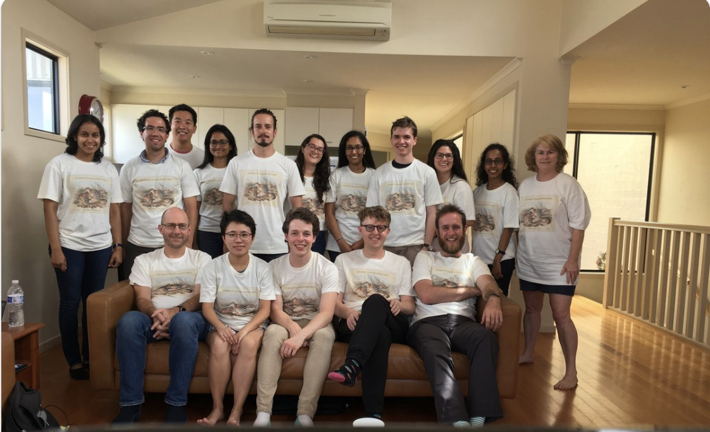

```{r setup, include=FALSE}
library(tidyverse)
library(sugrrants)
library(tsibble)
library(ggridges)
library(viridis)
library(forecast)
library(lubridate)
knitr::opts_chunk$set(echo = FALSE, message=FALSE, warning=FALSE, cache=TRUE, dev.args=list(bg=grey(0.9), pointsize=8))
```

# <span style="color:DarkBlue"> Agenda

- Motivation
- Research Aim
- What is EDA? How it can help?
- Research objectives
  - Visualizing probability distributions on deconstructed time
  - Spatio-temporal granularities and probability distribution plots
  - Clustering algorithms for grouping probability distributions on spatio-temporal granularities
- Timeline
- Acknowledgements

---

# <span style="color:DarkBlue"> Motivation

## Electricity smart meter technology 

Smart meters record electricity usage (per kWh) every 30 minutes and send this information to the electricity retailer for billing

.pull-left[
**Consumers** can save considerable amount on their electricity bill by 
<br>
- Switching on their hot water heater or do laundry when energy is cheaper, or when their solar system is generating surplus energy 
- Switching off appliances during peak demands
- Check usage and compare with similar homes 
]
.pull-right[

**Retailers** can reduce costs and increase efficiency
- Lowering metering and connection fees 
- Drawing insights into when customer is home, or sleeping, or even what appliances they are using based on usage figures
- Rewarding customers for mindful usage
]

---

## <span style="color:DarkBlue">  Data description (~ 40 billion half hourly observations)

.pull-left[

.center-left[
- Source
<br>
<br>
- Frequency
<br>
<br>
- Time Frame
<br>
<br>
- Spread
<br>
<br>
- Type
<br>
<br>
- Dimension
]
]

.pull-right[
.center-left[
Data61, CSIRO
<br>
<br>
<br>
Half hourly interval meter reading (Kwh)
<br>
<br>
<br>
2012 to 2014
<br>
<br>
<br>
14K (approx.) households based in Newcastle, New South Wales, and parts of Sydney
<br>
<br>
Spatio - Temporal Data
<br>
<br>
<br>
Univariate
]
]

---
class: middle left

# <span style="color:DarkBlue">  Research Aim

## <span style="color:Black"> Provide a platform to <span style="color:Crimson"> systematically explore <span style="color:Black">  multiple perspectives of <span style="color:Crimson"> spatio-temporal data <span style="color:Black"> across deconstructed time and space to find regular patterns or anomalies, explore clusters of behaviors or summarize the behavior through <span style="color:Crimson"> visualizing probability distributions <span style="color:Black">

---
## <span style="color:DarkBlue">  What is Exploratory Data Analysis?

.pull-left[
<br>
.center[

]
]
.pull-right[
<br>
<br>
Developed by **John Tukey** as a way of _*systematically*_ using the tools of statistics on a problem before a hypotheses about the data were developed

###  How can it help?

 - Big problem broken into pieces by focusing on subsets
<br>
 - Visualization of <span style="color:Crimson"> probability distributions <span style="color:Black"> at varying resolutions of time and space
<br>
 - Find regular patterns/ anomalies or pockets of similar behavior
<br>
 - Each visual representation poses a question
<br>
 - Action: draw insights or refine question
]

---

class: middle left

# <span style="color:DarkBlue"> Research objectives

- ### Visualization of probability distributions of deconstructed temporal data
<br>
<br>
- ### Spatio-temporal granularities and probability distribution plots
<br>
<br>
- ### Clustering algorithms for grouping probability distributions on spatio-temporal granularities
<br>
<br>
  

---
class: middle center

# <span style="color:DarkBlue"> Visualization of probability distributions of deconstructed temporal data

---

# <span style="color:DarkBlue"> Deconstructing temporal data - Granularities

.pull-left[
## Arrangement of time

 a) Linear  
 b) Cyclic
<br>
<br>
- <span style="color:#c33c3c"> **Granularities** : <span style="color:Black">  Abstractions of time based on Calendar
<br>
<br>
- <span style="color:#c33c3c"> **Linear granularities** : <span style="color:Black"> Days, weeks, months, years
<br>
<br>
- <span style="color:#c33c3c"> **Circular granularities** : <span style="color:Black"> DoW, MoY or HoD and nearly circular granularities like DoM or WoM   
]

.pull-right[
.center[]
]

 
---
class: middle left

# <span style="color:DarkBlue"> Visualizing distributions across circular granularities (I)

## Data description: 
**Source** ~  Buildings and Property Division at Monash University  
<br>
**Frequency** ~ 30 minutes interval smart meter data of Monash 
Residential Services  
<br>
**Time frame** ~ April 4, 2018 to May 31, 2018  
<br>
**Spread** ~ 73 living units (B1 05 and B4 29 chosen for analysis)  
---
class: top center

# <span style="color:DarkBlue"> Across <span style="color:Crimson">Day-of-Week

```{r okaygraph1, fig.height=6, fig.width=4,echo=FALSE}
load("Units_Data.Rdata")

Units_Data$`Timestamp UTC` <-lubridate::ymd_hms(Units_Data$`Timestamp UTC`)


vic_holidays <- holiday_aus(2018, state = "VIC")

SU_uniform_mutate <-Units_Data  %>% mutate(date = date(`Timestamp UTC`),wday = wday(date, label = TRUE, abbr = TRUE,
                       week_start = 1),
                       month = month(date, label = TRUE, abbr = TRUE),
                       year = year(date),
                       hour = hour(`Timestamp UTC`),
                       work = ifelse(wday %in% c("Mon", "Tue", "Wed", "Thu", "Fri"), "Yes", "No"))
                       
                       
p1 = SU_uniform_mutate %>% filter(Source=="B1 05") %>%
  group_by(date) %>%
  summarise(dkwh = sum(Value, na.rm=TRUE)) %>%
  mutate(wday = wday(date, label = TRUE, abbr = TRUE,
                     week_start = 1)) %>%
  ggplot(aes(x=wday, y=dkwh)) + geom_boxplot() + ylab("Energy consumption in KwH ") +  xlab("Day-of-Week") +
    coord_cartesian(ylim = c(0,0.6)) + ggtitle("B1 05")
   
p2 = SU_uniform_mutate %>% filter(Source=="B4 29") %>%
  group_by(date) %>%
  summarise(dkwh = sum(Value, na.rm=TRUE)) %>%
  mutate(wday = wday(date, label = TRUE, abbr = TRUE,
                     week_start = 1)) %>%
  ggplot(aes(x=wday, y=dkwh)) + geom_boxplot() + ylab("Energy consumption in KwH ") + xlab("Day-of-Week") +
    coord_cartesian(ylim = c(0,0.6)) + ggtitle("B4 29")

```
.pull-left[
```{r, echo=FALSE}
 p1
```
]
.pull.right[
```{r, echo=FALSE}
p2
```
]
---
class: top center

##<span style="color:DarkBlue"> Across  <span style="color:Crimson"> Day-of-Week <span style="color:DarkBlue"> and <span style="color:Crimson"> Hour-of-Day 

```{r okaygraph2,echo=FALSE}
p3 = SU_uniform_mutate %>% filter(Source=="B1 05") %>%
  group_by(wday,hour) %>% filter(wday %in% c("Tue","Wed","Thu","Fri","Sat","Sun")) %>% 
  ggplot(aes(x=as.factor(hour), y=Value,group=hour)) + geom_boxplot() +
  facet_wrap(~wday) + 
  ylab("Daily Consumpttion in KwH") +
  xlab("Hour-of-Day")+ 
    coord_cartesian(xlim= c(0,23), ylim = c(0,0.75))+  scale_x_discrete(breaks=c(0,5,10,15,20))+  ggtitle("B1 05")

p4 = SU_uniform_mutate %>% filter(Source=="B4 29") %>%
  group_by(wday,hour) %>% filter(wday %in% c("Tue","Wed","Thu","Fri","Sat","Sun")) %>% 
  ggplot(aes(x=as.factor(hour), y=Value, group=hour)) + geom_boxplot() +
  facet_wrap(~wday) + 
  ylab("Daily Consumpttion in KwH") +
  xlab("Hour-of-Day") +  
    coord_cartesian(xlim= c(0,23), ylim = c(0,0.75))+ scale_x_discrete(breaks=c(0,5,10,15,20))+  ggtitle("B4 29")

```
.pull-left[
```{r ,echo=FALSE}
 p3
```
]

.pull.right[
```{r ,echo=FALSE}
p4
```
]


---
class: top center

## <span style="color:DarkBlue">  Across <span style="color:Crimson">Hour-of-Day <span style="color:DarkBlue"> and <span style="color:Crimson">Work-Day/Non-Work-Day

```{r okaygraph, fig.height=6, fig.width=4,echo=FALSE}
 s1 <- SU_uniform_mutate %>%
  mutate(work = ifelse(date %in% vic_holidays$date, "No", work))

 
b1_Quantile <- s1 %>% filter(Source=="B1 05") %>% group_by(work,hour) %>% 
   do({x <- .$Value
   map_dfr(.x = seq(0.1,0.9,0.1),
           .f = ~ tibble(Quantile = .x,
                             Value = quantile(x, probs = .x,na.rm=TRUE)))
   })
 
p5 <- b1_Quantile %>% ggplot(aes(x=hour,y=Value,col=as.factor(Quantile))) +geom_line() + scale_x_continuous(breaks=seq(1, 24, 5)) +theme(legend.position = "bottom") + facet_wrap(~work, labeller = "label_both") + ylab("Total kwh") +  xlab("Hours")+ theme(legend.position = "none",strip.text = element_text(size = 10, margin = margin()))+ coord_cartesian(ylim = c(0,0.75)) + ggtitle("B1 05")

b2_Quantile <- s1 %>% filter(Source=="B4 29") %>% group_by(work,hour) %>% 
   do({x <- .$Value
   map_dfr(.x = seq(0.1,0.9,0.1),
           .f = ~ tibble(Quantile = .x,
                             Value = quantile(x, probs = .x,na.rm=TRUE)))
   })
 
p6 <- b2_Quantile %>% ggplot(aes(x=hour,y=Value,col=as.factor(Quantile))) +geom_line() + scale_x_continuous(breaks=seq(1, 24, 5)) +theme(legend.position = "bottom") + facet_wrap(~work, labeller = "label_both") + ylab("Total kwh") +  xlab("Hours")+ theme(legend.position = "none",strip.text = element_text(size = 10, margin = margin())) + coord_cartesian(ylim = c(0,0.75)) +  ggtitle("B4 29")

# grid.arrange(p5, p6,  ncol = 2)
```
.pull-left[
```{r, echo=FALSE}
 p5
```
]
.pull.right[
```{r, echo=FALSE}
p6
```
]
---

class: middle left

### <span style="color:DarkBlue"> Aggregating information across different circular granularities communicates completely different aspects of data

### <span style="color:DarkBlue"> Exhaustive sets of visual representation required for multiple perspectives on data

---

class: middle left

## <span style="color:DarkBlue"> Visualizing distributions across circular granularities (II)
  
.pull-left[

Can combinations of these circular granularities be plotted for effective exploration?
<br>

a) Day-of-Year and Day-of-Month
<br>

b) Week-of-Month and Day-of-Month
<br>

c) Week-of-Month and Week-of-Year
<br>


d) Month-of-Year and Day-of-Year
<br>

Frequency ~ 30 minutes interval smart meter data of Victoria (aggregate)  
Time frame ~ January, 2002 to March 1, 2015 

]

.pull-right[
```{r moy-dom,echo=FALSE, out.width="70%", fig.align = 'right'}

VIC <- read.csv("VIC2015/Data/demand_VIC.csv")
VIC$Date <- as.Date(VIC$Date,origin = "1899-12-30")

first_day_of_month_wday <- function(dx) {
  day(dx) <- 1
  wday(dx)
}

VIC <- VIC %>%mutate(Indx_Year = year(Date),
                     Indx_Month = month(Date, label = FALSE, abbr = TRUE),
                     Indx_Wk_Yr = week(Date),
                     Indx_Wk_Month = ceiling((day(Date) + first_day_of_month_wday(Date) - 1) / 7),
                     Indx_Day_Week = wday(Date, label=FALSE, abbr=TRUE,
                                          week_start=1),

                     Indx_Day_Month = day(Date),

                     Indx_Day_Year =  yday(Date),

                     Indx_Weekend=if_else(Indx_Day_Week %in% c(6,7),1,0),

                     Indx_HlHr_day = Period,
                     month = month(Date, label = FALSE, abbr = TRUE),
         year =  year(Date),
         yday =yday(Date),
         wday = wday(Date, label=FALSE, abbr=TRUE,
                     week_start=1),
         bow = (wday - 1) * 48 + Period,
         dom = day(Date),
         bom = (dom - 1) * 48 + Period,
         Weekend=if_else(wday %in% c(6,7),1,0),
         Indx_hour = ceiling(Period/2),
         Indx_Hour_Yr = Indx_hour + 24*(yday-1),
         Indx_Hour_Month = Indx_hour + 24*(Indx_Day_Month-1),
         Indx_Hour_Wk = Indx_hour + 24*(wday-1))
         
         


VIC <- as_tibble(VIC)
```

```{r allFig, out.height=400,out.width="120%", echo=FALSE, eval=TRUE, fig.align="center"}
library(lvplot)
library(gridExtra)

par(mfrow = c(2, 2))

p1 <- VIC%>% filter(year %in% c(2012, 2013, 2014),Indx_Day_Month %in% c(1,15,29,31))%>% ggplot(aes(yday,OperationalLessIndustrial,group = yday)) + geom_boxplot(width=10)+ facet_wrap(~Indx_Day_Month) + ylab("Electricity Demand [KWh]") +
  xlab("Days of the Year") + scale_x_discrete(breaks=seq(0,366,60)) +theme(legend.position = "bottom",strip.text = element_text(size = 7, margin = margin())) + ggtitle("(a) Boxplot")


p2 <- VIC%>% filter(year %in% c(2012, 2013, 2014),Indx_Wk_Month %in% c(1,2,4))%>% ggplot(aes(as.factor(Indx_Day_Month),OperationalLessIndustrial)) + geom_violin(alpha = 0.03)+ facet_wrap(~Indx_Wk_Month,nrow=3) + ylab("") + xlab("Days of the Month") + theme(legend.position = "bottom",strip.text = element_text(size = 7, margin = margin())) + scale_x_discrete(breaks=seq(0,31,5))+ scale_y_continuous(breaks = seq(2000,9000,2000))+ ggtitle("(b) Violin plot")


p3 <- VIC%>% dplyr:::filter(year %in% c(2012, 2013, 2014),Indx_Wk_Month %in% c(1,2,5),Indx_Wk_Yr <20)%>% ggplot(aes(x=OperationalLessIndustrial,y=as.factor(Indx_Wk_Yr),group=Indx_Wk_Yr)) + geom_density_ridges2() +facet_wrap(~Indx_Wk_Month) + xlab("Electricity Demand [KWh]") + ylab("Weeks of the Year") + scale_x_continuous(breaks = seq(2000,10000,3000)) + theme(legend.position = "bottom",strip.text = element_text(size = 7, margin = margin())) + ggtitle("(c) Ridge plot")


VIC_moy_doy <- VIC%>% filter(year %in% c(2012, 2013, 2014)) %>%
  group_by(Indx_Month,yday) %>%
  do({x <- .$OperationalLessIndustrial
  map_dfr(.x = seq(0.1,0.9,0.1),
          .f = ~ tibble(Quantile = .x,
                            Value = quantile(x, probs = .x,na.rm=TRUE)))
  }) %>%  filter(Indx_Month %in% c(1,7,11))

p4 <- VIC_moy_doy %>%ggplot(aes(x=yday,y=Value,col=as.factor(Quantile),group=yday)) + geom_line() + facet_wrap(~Indx_Month)+ scale_x_continuous(breaks=seq(1, 336, 60)) + ylab("")  + xlab("Day of the Year") + theme(legend.position = "none",strip.text = element_text(size = 7, margin = margin())) + ggtitle("(d) Decile plot")

grid.arrange(p1, p2, p3, p4, ncol = 2)

```
]
---


## <span style="color:DarkBlue"> Harmonies and Clashes

**Harmonies** Combinations of circular granularities which facilitate EDA when plotted together

Examples: 

- DoW and HoD
- HoD and Working Day/ Non-Working Day
- DoW and MoY

**Clashes** Combinations of circular granularities which are conflicts in bringing out the best of EDA when plotted together

Examples: 

- DoY and DoM
- MoY and DoY
- WoM and DoM

--

#### <span style="color:DarkBlue">  Why Harmonies work and Clashes don't?

- Nature of time granularities and the way they map to calendars

---

<!-- class: middle center -->

<!-- # <span style="color:#c33c3c"> Formalizing the theory to show why some displays work while others are ineffective for exploration of data -->

<!-- --- -->

#  <span style="color:DarkBlue"> Formalizing the theory to study properties of granularities
---
## <span style="color:DarkBlue"> Linear Time Granularities 

_* By Bettini et al. "A Glossary of Time Granularity Concepts"*_

**Definition:** A **time domain** is a pair $(T; \le)$ where $T$ is a non-empty set of time instants and $\le$ is a total order on $T$.

**Definition:** A linear **granularity** is a mapping $G$ from the integers to subsets of the time domain such that:

  (C1) if $i < j$ and $G(i)$ and $G(j)$ are non-empty, then each element of $G(i)$ is less than all elements of $G(j)$, and  
  (C2) if $i < k < j$ and $G(i)$ and $G(j)$ are non-empty, then $G(k)$ is non-empty.  
<br>
<br>
The first condition implies that the granules in a linear granularity are non-overlapping and their index order is same as time order
<br>
<br>
_*These definitions for linear granularities are inadequate for conceptualizing circular granularities since the linearity imposes a restriction on reflecting periodicities in time*_

---

## <span style="color:DarkBlue"> Circular Time Granularities

**Definition:** A **circular granularity** $C$ with a modular period m is defined to be a mapping from the integers $Z$ (Index Set) to $Z_m$, such that $C(s) = (s\mod m)$ for $s \in Z$ and $Z_m = \{0, 1, ..., (m-1)\}$, (set of integers modulo $m$).

#### Illustrative calendar categorisations

```{r Modarith, echo=FALSE, out.width="70%"}
knitr::include_graphics("modarith-table.png")
```
_* $n_i$ is the number of categories created by $C_i$ *_

---

### <span style="color:DarkBlue"> Rules to control for Clashes

#### Structurally Empty Combinations (Examples: DoM and DoY)
**Rule 1** 

For two circular granularities $C_1$ and $C_2$ of the form $C_1 = (s \mod m_1)$ and $C_2 = (s \mod m_2)$, choosing $m_1, m_2$>1 such that $HCF(m_2, m_1) >$  1 will lead to structurally empty combinations provided $s > m_1m_2$. HCF refers to the largest common factor. 

**Rule 2**

For two circular granularities $C_3 = (\lfloor s/a\rfloor   \mod m_1)$ and $C_4 = (\lfloor s/b\rfloor \mod m_2)$ and $s > m_1m_2$,

Choosing $a, b, m_1>1, m_2 > 1$ with $am_1,bm_2$ being a perfect multiple of the other one will yield empty combinations provided  $am_1 \neq b$ or $bm_2 \neq a$.


#### Non-functional Empty Combinations (Examples: Working/Non-working day and HoD)

- T observations for a linear bottom granularity
- C1 and C2 are two circular granularities with modular period $m_1$ and $m_2$ 

Then $T \ge m_1m_2k$, k>30 (approx) for density estimates
---

<!-- # Illustration of Rules -->


<!-- ```{r chck1, echo=FALSE, out.width="50%",comment=FALSE} -->
<!-- # For validating rule 1, put any value of p,   -->
<!-- # m1 and m2 to check if there is any expected missing combination -->
<!-- rule_1 <- function(p, m1, m2) -->
<!-- { -->
<!--   L1 <-  ceiling(p) %% m1   -->
<!--   L2 <-  ceiling(p) %% m2 -->
<!--   data_s <-tibble(L1, L2, data =runif(p, min = 0, max = 1))   -->
<!--   # data_s %>% ggplot(aes(x = as.factor(c1), y=c2))+  -->
<!--   # geom_point(alpha=0.005) -->
<!--  #All possible combinations that are possible -->
<!--  Allcomb <- tidyr::expand(data_s, L1, L2) -->
<!--  #All possible combinations that  exist -->
<!--  combexist <- tidyr::expand(data_s, nesting(L1, L2)) -->
<!--  #All possible combination that are missing -->
<!--  cmbmiss <- Allcomb %>% anti_join(combexist)  -->
<!--  #Print missing combinations -->
<!-- } -->
<!-- ``` -->
<!-- .left-column[ -->

<!-- .pull-left[ -->
<!-- ```{r rule1, echo=FALSE, eval=TRUE, results='asis',fig.cap=" (Top) of two circular granularities with different modular periods, (Bottom) Missing combinations for each case"} -->
<!-- s <- 1:8  -->
<!-- C1 <- s %% 2 -->
<!-- C2 <- s %% 4 -->

<!-- C3 <- s %%2 -->
<!-- C4 <- s %%3 -->

<!-- library(knitr) -->
<!-- library(xtable) -->
<!-- knitr::kable(cbind(s, C1, C2), format = "html") -->
<!-- ``` -->

<!-- ] -->

<!-- .pull-left[ -->
<!-- ```{r, echo=FALSE} -->
<!-- v11 <- knitr::kable(rule_1(1:8,m1 = 2, m2 = 4), format='html') -->
<!-- v11 -->
<!-- ``` -->
<!-- ] -->
<!-- ] -->


```{r checkrule2, echo=FALSE, out.width="50%"}

# rule_2 <-  function(p,a,b,m1,m2)
#   
# {
#   L1 <-  ceiling((p/a)) %% m1
#   L2 <-  ceiling((p/b)) %% m2
#   data_s <-tibble(L1, L2, data =runif(p, min = 0, max = 1)) 
#   # data_s %>% ggplot(aes(x = as.factor(c1), y=c2)) + geom_point(alpha=0.005)
#   #All posiible combination that are possible
#   Allcomb <- tidyr::expand(data_s, L1, L2)
#   #All possible combination that can exist
#   combexist <- tidyr::expand(data_s, nesting(L1, L2))
#   #All possible combination that can exist
#   cmbmiss <- Allcomb %>% anti_join(combexist) 
#   #Print missing combinations
#   #print(cmbmiss)
# }

```

<!-- .right-column[ -->
<!-- .pull-left[ -->
<!-- ```{r dataeg2, echo=FALSE, eval=TRUE, results='asis'} -->
<!-- s <- c(1:20)  -->
<!-- C5 <-   ceiling((s/3)) %% 2 -->
<!-- C6 <-   ceiling((s/6)) %% 3 -->
<!-- C7 <-   ceiling((s/3)) %% 5 -->
<!-- C8 <-   ceiling((s/5)) %% 3 -->
<!-- C9 <-   ceiling((s/2)) %% 3 -->
<!-- C10 <-   ceiling((s/6)) %% 4 -->


<!-- knitr::kable(cbind(s, C9, C10), format = "html") %>% kableExtra::kable_styling(font_size=10) -->
<!-- knitr::kable(rule_2(s, a=2,b=6,m1=3,m2=4) , format = "html")%>% kableExtra::kable_styling(font_size=10) -->
<!-- ``` -->
<!-- ] -->

<!-- .pull-right[ -->
<!-- ```{r, echo=FALSE} -->
<!-- v12 <- knitr::kable(rule_2(s, a=2,b=6,m1=3,m2=4) , format = "html") -->
<!-- v12 -->
<!-- ``` -->
<!-- ] -->
<!-- ] -->

## <span style="color:DarkBlue"> Timeline
```{r Timeline, echo=FALSE, eval=TRUE}
 library(kableExtra) 
 library(tidyverse)
 Date = c("February, 2019", "April, 2019", "May, 2019", "June 2019", "June - July, 2019", "December, 2019", "February, 2020","February, 2020","April, 2020","June, 2020", "July, 2020",  "December, 2020", "February, 2021", "May 2021")
Description = c("Candidature Confirmation", "Visualization of probability distributions of deconstructed temporal data", "Tool for visualizing probability distribution of deconstructed temporal data", "geom_hdr","Internship", "Visualization of probability distributions of deconstructed spatio-temporal data", "Tool for visualizing probability distribution of spatio temporal data", "Mid Candidature Review", "Visualization of probability distributions of deconstructed spatio-temporal data", "Internship","Attend Conference", "Clustering of spatio-temporal data based on probability distributions","Pre-Submission Review", "Thesis Submission")

Product = c("Milestone","Complete Paper", "R Package", "R Package", "Internship"," Draft Paper","R Package","Milestone", "Complete Paper", "Internship", "IASC isi 2020 (Tentative)", "Draft Paper","Milestone","Milestone")

out <- cbind(Date, Description, Product)
out1 <- as_tibble(out)
knitr::kable(out) 
```

---

# <span style="color:DarkBlue"> Acknowledgements

.pull-left[
### Supervisors
<br>
Professor Rob J Hyndman  
<br>
<br>
Professor Dianne Cook  
<br>
<br>
Dr Peter Toscas
<br>
<br>

### Monash University 
### Data61, CSIRO 


]

.pull-right[
### NUMBATS
<br>
<br>
```{r numbats, echo=FALSE, out.width="100%"}
  
```
]

---

class: middle center

## <span style="color:DarkBlue"> Questions?
  